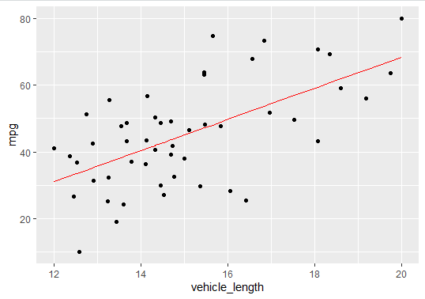
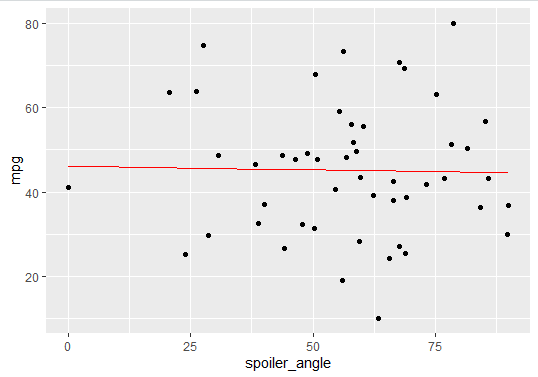
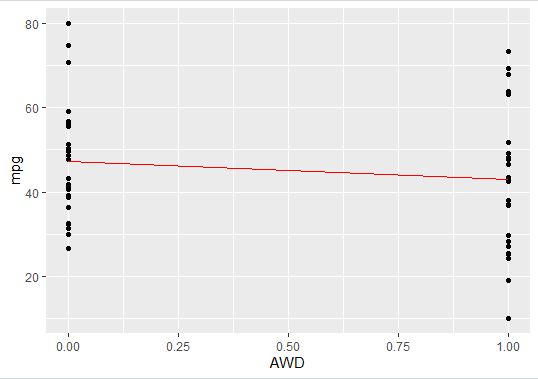
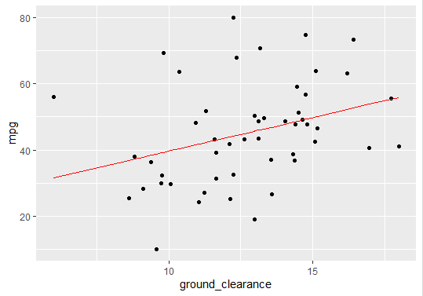
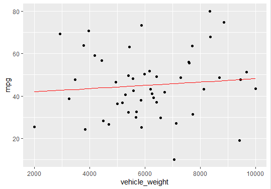
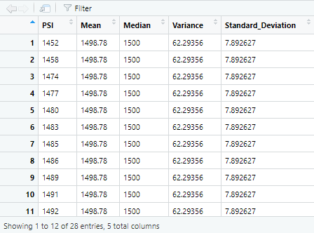
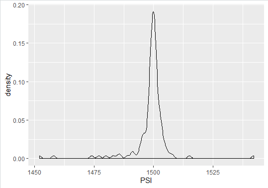

# MechaCar Technical Report

**AutosRUs’ newest prototype, the MechaCar, is suffering from production troubles. There are a number of issues surrounding the vehicle’s specifications and manufacturing process that are blocking the manufacturing team from proceeding. We performed a series of statistical tests on the production data in order to justify some last-minute design decision.**

We combined our understanding of R and statistics with the manufacturing datasets provided:  

- [MechaCar_mpg.csv]()- The results of an mpg testing dataset of 50 potential prototype MechaCars. The MechaCar prototypes were produced using multiple design specifications to identify ideal vehicle performance. Multiple metrics such as vehicle length, vehicle weight, spoiler angle, drivetrain, and ground clearance were collected for each vehicle.  

- [Suspension_coil.csv]()- MechaCar suspension coil test results from multiple production lots. In this dataset, the weight capacity of multiple suspension coils were tested to determine if the manufacturing process is consistent across lots. 

We generated a robust technical report that can be used to justify design choices using quantitative and qualitative reasoning.  

### MPG Regression
**We used multiple linear regression to design a linear model that predicts the mpg of MechaCar prototypes using a number of variables within the MechaCar mpg dataset.**  

Variables/coefficients that provided a non-random amount of variance to the mpg values in the dataset:
- Vehicle Length
- Vehicle Height
- Spoiler Angle
- Ground Clearance   

**AWD** has no significant linear relationship, the dependent value is determined by random chance and error. Therefore, the linear model is a flat line with a slope of 0.  

Using our visualization in combination with our calculated p-value and r-squared value, we have determined that there is a significant relationship between **mpg** and **vehicle_length**, as well as, **mpg** and **ground_clearance.**  

This linear model does **not** predict mpg of MechaCar prototypes effectively. After reviewing our findings, we could be more effective by not including non-substancial metrics in our statistical test.  
  
## Suspension Coil Summary
**In our RScript file, we created a summary statistics table for the suspension coil’s pounds-per-inch continuous variable, including the following metrics:** 
  - Mean
  - Median
  - Variance
  - Standard deviation  
  

  
  The design specifications for the MechaCar suspension coils dictate that the variance of the suspension coils must not exceed 100 pounds per inch. Our **coil_summary_table** shows that the current manufacturing data meets this design specification with a variance of 62.29356. 
  
## Suspension Coil T-Test
Using the same suspension coil data and the MechaCarChallenge.RScript file, We determined that the suspension coil’s pound-per-inch results are **not** statistically different from the mean population results of 1,500 pounds per inch. 

 
 

## Design Our Own Study
**We designed a study that compares the performance of the MechaCar prototype vehicle to other comparable vehicles on the market. A statistical study that can quantify how the MechaCar outperforms the competition. In our study design, we considered the following:**  

- Metrics that would be of interest to a consumer
- Determine what question we would ask, what the null and alternative hypothesis would be to answer that question, and what statistical test could be used to test this hypothesis.
- Knowing what test should be used, what data should be collected?  
 
Many companies are capturing and analyzing data to increase thier opportunity for growth. Customer satisfaction surveys, units sold, service repair information, and a variety of many other metrics are typically obtained. Collecting this data is excellent and leads to the ability to make more informed decisions. However, when using data to make informed decisions in a professional environment, implementing a statistics function is not the biggest challenge. Rather, it’s determining what questions to ask.  

### What metrics would be of interest to a consumer (cost, fuel efficiency, color options, etc.)?  
There are tons, but we are going to narrow it down to three that MechaCar would benefit from taking a look at.  
- Color  
- In-Car Technology  
- Cost  

**Color**  
We chose color as the top metric that would be of interest to a consumer because that is the first thing people see about any car. If the color is attractive, then we have their attention to show them how the performance of the MechaCar prototype vehicle is to comparable vehicles on the market.  

To verify the top selling color cars, we would need to test our question with a regression model. To use a multiple linear regression model, we would need to collect numerical variables, such as number of units sold by color and time. Then, we can estimate a sample size by years. We can collect the data that has been curated from other dealerships from previous years. Although, color seems like a bar plot would be appropriate. Bar plots are used to visualize categorical data and can be used to represent the frequency of each categorical value in a list of categorical data. Using a multiple linear regression model will allow us to see trends. Such as, although color A was the third best selling vehicle in 2019, we can see that it has been on a downward trend since 2015. That color B will be a better choice because it is showing that sales are expected to increase and surpass those of color A in 2020.  

**In-Car Technology**  
[The 2017 AutoTrader Car Impact Tech Study](http://press.autotrader.com/research-and-data), sponsored by Cox Automotive helps dealers understand which technology features consumers want in their cars. One of the most insightful statistics from the study was the amount of money car buyers are willing to pay for the technology features they want. Consumers will spend an average of $2,276 to have their preferred tech capabilities. Because of the awesome insight this study brought us in 2017 and how rapid technology grows, we wanted more relevent numbers going into 2020.  

To verify the top selling in-car technology, we would want to use a more advanced visualization. The boxplot is used to visualize a variety of summary statistics for a continuous numerical vector. Boxplots are very common in data science due to the density of information contained within a single visualization, as well as the boxplot’s ability to compare measurements across grouping factors. To generate a boxplot in ggplot2, we must supply numeric vector assigned to the y-value. This is due to the ggplot accounting for multiple boxplots in a single figure. If we were to supply all the in-car technology options as our categorical grouping factor to x, we can create a boxplot that compares measurements from a variety of groups. The grouped boxplots would be easy to read and interpret to answer what in-car technology consumers have purchased. As to include those features in our MechaCar.  

**Cost**  
Consumer want to feel like they got a deal. Cost is our last metric to study. MechaCar would have to have a completed vehicle to compare to other "comparable" vehicles. Both vehicles would have to be as close in all specs in order to have accurrate and meaningful results. Due to this high importantce, a few test would need to be done. The order of execution is imperative. 

- The two sample test  
- pair t-test  
- Heatmap
  
The two-sample t-test will be used to compare two samples from a single population dataset. We would perform a two-sample t-test on each assumed comparable vehicle. Data that seems reliable from these results will provide us with the list of vehicles to continue with a pair t-test, because we would pair observations in one dataset with observations in another.  

We would use the pair t-test to compare cost of a MechaCar across the list of comparable vehicles. If the difference between our paired observations (the true mean difference, or “μd”) is equal to zero, then that comparable vehicle will go on into our heatmap plot.  

Heatmap plots help visualize the relationship between one continuous numerical variable and two other variables (categorical or numerical). Heatmaps display numerical values as colors on a two-dimensional grid so that value clusters and trends are readily identifiable. We can visualize the average cost of comparable vehicles across the type of vehicle class from 2010 to 2020.
