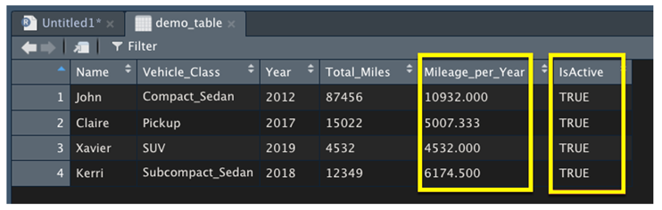
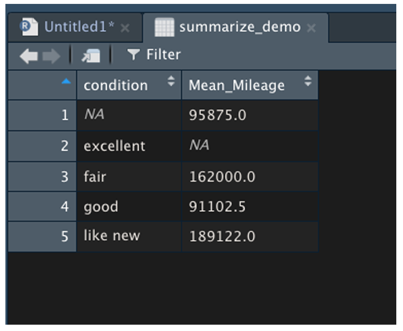
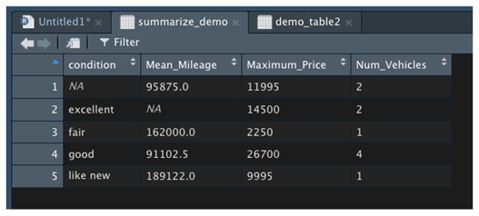
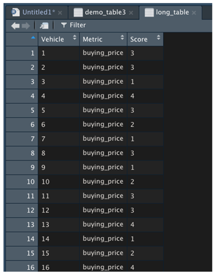
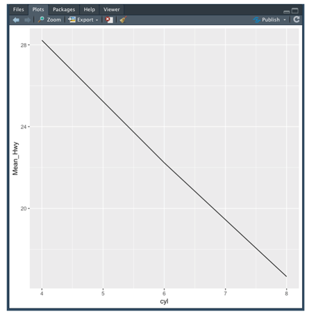
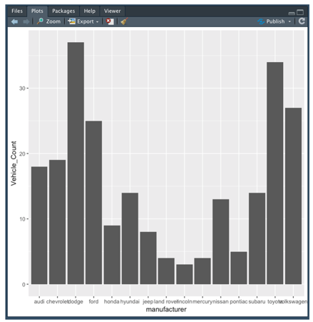
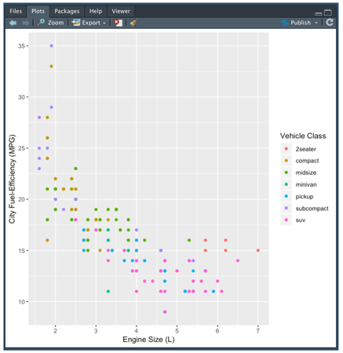
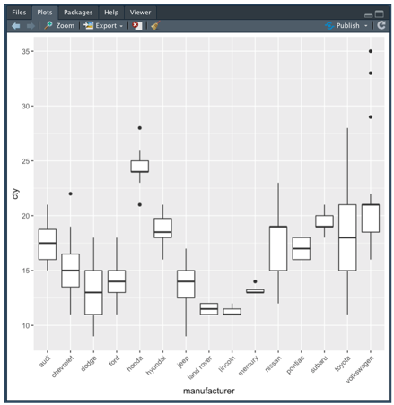
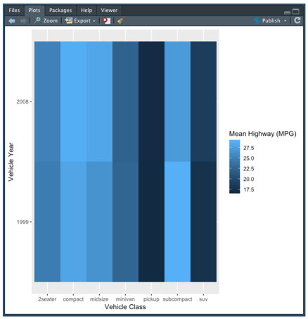

# R_Analysis

Module 15 ReadMe

#### Table of Contents

[Project Overview](#project-overview)  
[Resources](#resources)  
[Objectives](#objectives)  
[Summary](#summary)  
[Challenge Overview](#challenge-overview)  
[Challenge Objectives](#challenge-objectives)  
[Challenge Summary](#challenge-summary)  
[Limitations](#limitations)

## Project Overview
In R-Analysis, we applied our understanding of statistics and hypothesis testing to analyze a series of datasets from the automotive industry. Our analysis includes visualizations, statistical tests, and interpretation of the results. All of our statistical analysis and visualizations are written in the R programming language.  

Throughout the module, we extract, transform, and load (ETL) data; visualize the data; and analyze the data using R. Additionally, we learned a variety of statistical tests, their real-world application in data science, and their implementation in R.  

## Resources  
- **Data Source:** [demo.csv](), [demo.json](), [demo2.csv](), [mpg_modified](), [used_car_data](), [Vehicle_Data](), [MechaCar_mpg.csv](), [Suspension_coil.csv]() 
- **Software:** R, RStudio, Rtools

## Objectives
- Load, clean up, and reshape datasets using tidyverse in R.
- Visualize datasets with basic plots such as line, bar, and scatter plots using ggplot2.
- Generate and interpret more complex plots such as boxplots and heatmaps using ggplot2.
- Plot and identify distribution characteristics of a given dataset.
- Formulate null and alternative hypothesis tests for a given data problem.
- Implement and evaluate simple linear regression and multiple linear regression models for a given dataset.
- Implement and evaluate the one-sample t-Tests, two-sample t-Tests, and analysis of variance (ANOVA) models for a given dataset.
- Implement and evaluate a chi-squared test for a given dataset.
- Identify key characteristics of A/B and A/A testing.
- Determine the most appropriate statistical test for a given hypothesis and dataset.

## Summary  
### Load, clean up, and reshape datasets using tidyverse in R.  
The **tidyverse** package contains libraries such as dplyr, tidyr, and ggplot2. These packages work together to help simplify the process of creating transformed data columns, grouping data using factors, reshaping our two-dimensional data structures, and visualizing our results using plots.  
#### Load  
To install the tidyverse in our R environment, run the following command in the R console:  
> install.packages("tidyverse")  

Raw data is often insufficient in telling the full story. Usually when we are analyzing data, we want to perform calculations and incorporate the calculations back into the raw data to ease in downstream analysis. Tidyverse’s dplyr library transforms R data.  
> library(tidyverse)

#### Clean up  
The dplyr library contains a wide variety of functions that can be chained together to transform data quickly and easily. By chaining functions together, the user does not need to assign intermediate vectors and tables. Instead, all of the data transformation can be performed in a single assignment function that is easy to read and interpret.  

- **mutate()** transforms a data frame and include new calculated data columns.  

- **group_by()** tells dplyr which factor (or list of factors in order) to group our data frame by.  

- **summarize()** creates columns in our summary data frame and will use statistics summary functions such as mean(), median(), sd(), min(), max(), and n().

**mutate()**  

**group_by()**  

**summarize()**  

#### Reshape
When performing more involved data analytics and visualizations, there may be situations where the shape and design of our data frame is overcomplicated or incompatible with the libraries and functions we wish to use. The tidyr library from the tidyverse has the gather() and spread() functions to help reshape our data.  

- **gather()** changes the dataset to a long format.  

- **spread()** spreads out a variable column of multiple measurements into columns for each variable.  

**gather()**  

**spread()**  

 

### Visualize datasets with basic plots such as line, bar, and scatter plots using ggplot2.  
 

### Generate and interpret more complex plots such as boxplots and heatmaps using ggplot2.  

### Plot and identify distribution characteristics of a given dataset.  
When it comes to data analysis, characterizing the distribution of numerical data is as important as characterizing the different data types.  

Normal distribution, or normality, is commonly referred to as “the bell curve,” and describes a dataset where values farther from its mean occur less frequently than values closer to its mean.  The **qualitative test for normality** is a visual assessment of the distribution of data, which looks for the characteristic bell curve shape across the distribution.  

The **quantitative test for normality** uses a statistical test to quantify the probability of whether or not the test data came from a normally distributed dataset. In most cases, data scientists will use the Shapiro-Wilk test for normality, though there are many other statistical tests available. The **shapiro.test()** function only requires the numeric vector of values you wish to test. If the p-value is greater than 0.05, the data is considered normally distributed. 

When the asymmetrical distribution has one distribution tail that is longer than the other, this is commonly referred to as a **skewed distribution** and there are two types—left skew and right skew.  
- A data distribution is considered to be **left skewed**, or negative skewed, if the left tail is longer than the right. Left skewed data has a higher probability that extreme negative values exist within the dataset.  

- A data distribution is considered to be **right skewed**, or positive skewed, if the right tail is longer than the left. Right skewed data has a higher probability that extreme positive values exist within the dataset. 

### Formulate null and alternative hypothesis tests for a given data problem.  
One of the largest and most critical concepts in statistics is hypothesis testing. In data science, we use statistical hypothesis testing to determine the probability of an event (or set of observations) under particular assumptions. There are two types of statistical hypothesis:
- The null hypothesis is also known as H0 and is generally the hypothesis that can be explained by random chance.

- The alternate hypothesis is also known as Ha and is generally the hypothesis that is influenced by non-random events.  

Hypothesis testing uses five steps:
1. Generate a null hypothesis, its corresponding alternate hypothesis, and the significance level.
2. Identify a statistical analysis to assess the truth of the null hypothesis.
3. Compute the p-value using statistical analysis.
4. Compare p-value to the significance level.
5. Reject (or fail to reject) the null hypothesis and generate the conclusion.

### Implement and evaluate simple linear regression and multiple linear regression models for a given dataset.  
**linear regression** is a statistical model that is used to predict a continuous dependent variable based on one or more independent variables fitted to the equation of a line. The job of a linear regression analysis is to calculate the slope and y intercept values (also known as coefficients) that minimize the overall distance between each data point from the linear model. There are two basic types of linear regression:
- **Simple linear regression** builds a linear regression model with one independent variable.

- **Multiple linear regression** builds a linear regression model with two or more independent variables. 

### Implement and evaluate the one-sample t-Tests, two-sample t-Tests, and analysis of variance (ANOVA) models for a given dataset.  
There are two main forms of the t-test that we use: the one-sample t-test and the two-sample t-test. 
- The **one-sample t-test** is used to assert if there is a statistical difference between the means of a sample dataset and hypothesized, potential population dataset.  

- The **two-sample t-test** determines whether the means of two samples are statistically different.

- A **pair t-test** is when we pair observations in one dataset with observations in another.  

- the **analysis of variance (ANOVA) test** compares the means across more than two samples or groups.  

### Implement and evaluate a chi-squared test for a given dataset.  
The **chi-squared test** is used to compare the distribution of frequencies across two groups and tests the following hypotheses:
- H0 : There is no difference in frequency distribution between both groups.

- Ha : There is a difference in frequency distribution between both groups.  

Before we can perform our chi-squared analysis, we must ensure that our dataset meets the assumptions of the statistical test:
1. Each subject within a group contributes to only one frequency. In other words, the sum of all frequencies equals the total number of subjects in a dataset.
2. Each unique value has an equal probability of being observed.
3. There is a minimum of five observed instances for every unique value for a 2x2 chi-squared table.
4. For a larger chi-squared table, there is at least one observation for every unique value and at least 80% of all unique values have five or more observations.  

### Identify key characteristics of A/B and A/A testing.  
**A/B testing** is a randomized controlled experiment that uses a control (unchanged) and experimental (changed) group to test potential changes using a success metric. A/B testing is used to test whether or not the distribution of the success metric increases in the experiment group instead of the control group.  

### Determine the most appropriate statistical test for a given hypothesis and dataset.
We can apply the following logic to determine the most appropriate statistical test: 
- If the success metric is numerical and the sample size is small, a z-score summary statistic can be sufficient to compare the mean and variability of both groups.

- If the success metric is numerical and the sample size is large, a two-sample t-test should be used to compare the distribution of both groups.

- If the success metric is categorical, you may use a chi-squared test to compare the distribution of categorical values between both groups.   

## Limitations  
R and most of R’s libraries are licensed as General Public License, version 2 (GPL 2). This means that if you program or model anything using R, GPL forces your application, program, or script to be open source.
